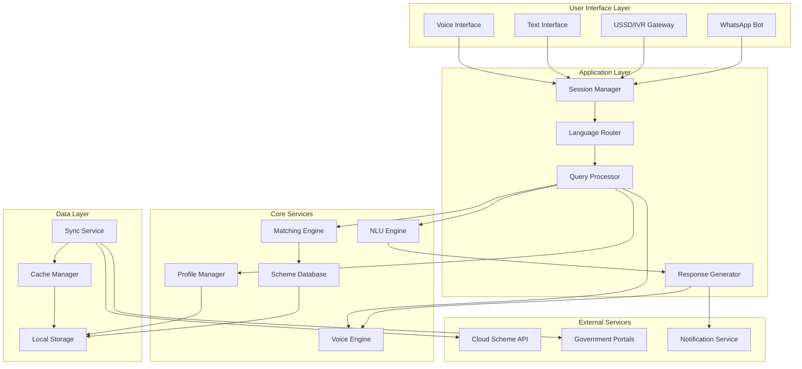
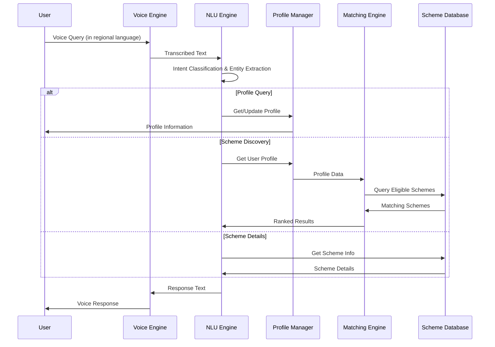

# Design Document: Bharat AI Civic Assistant

## Overview

The Bharat AI Civic Assistant is a voice-first, multilingual AI platform that democratizes access to government schemes for Indian citizens. The system architecture prioritizes offline-first operation, minimal data usage, and natural language interaction in 11 Indian languages. The platform consists of five core subsystems: Voice Processing, Profile Management, Scheme Matching, Natural Language Understanding, and Data Synchronization.

The design emphasizes edge computing with local-first data storage, enabling operation in low-connectivity environments typical of rural India. The system uses a hybrid architecture where core functionality runs on-device while optional cloud services provide scheme updates and advanced AI capabilities when connectivity permits.

## Architecture

### System Architecture



### Deployment Architecture

The system supports three deployment modes:

1. **Mobile App (Primary)**: Native Android app with full offline capability
2. **Web Progressive App**: Browser-based access with service workers for offline support
3. **Telephony Integration**: USSD/IVR for feature phone access with server-side processing

### Data Flow



## Components and Interfaces

### 1. Voice Engine

**Responsibilities:**
- Speech-to-text (STT) conversion for 11 Indian languages
- Text-to-speech (TTS) synthesis with natural prosody
- Audio quality assessment and noise filtering
- Language detection and switching

**Interfaces:**

```typescript
interface VoiceEngine {
  // Convert speech to text
  transcribe(audio: AudioBuffer, language: LanguageCode): Promise<TranscriptionResult>
  
  // Convert text to speech
  synthesize(text: string, language: LanguageCode, voice: VoiceProfile): Promise<AudioBuffer>
  
  // Detect spoken language
  detectLanguage(audio: AudioBuffer): Promise<LanguageCode>
  
  // Assess audio quality
  assessQuality(audio: AudioBuffer): AudioQualityMetrics
}

interface TranscriptionResult {
  text: string
  confidence: number
  language: LanguageCode
  alternatives?: string[]
}

interface AudioQualityMetrics {
  signalToNoiseRatio: number
  clarity: number
  isAcceptable: boolean
}

type LanguageCode = 'hi' | 'en' | 'ta' | 'te' | 'bn' | 'mr' | 'gu' | 'kn' | 'ml' | 'pa' | 'or'
```

**Implementation Notes:**
- Use lightweight on-device models (e.g., Whisper-tiny, Coqui TTS)
- Fallback to cloud STT/TTS when connectivity available and accuracy is low
- Cache common phrases and responses for instant playback
- Support streaming audio for real-time processing

### 2. Natural Language Understanding (NLU) Engine

**Responsibilities:**
- Intent classification (scheme_search, profile_update, scheme_details, application_help)
- Entity extraction (age, income, location, scheme_name, document_type)
- Context management across conversation turns
- Query disambiguation

**Interfaces:**

```typescript
interface NLUEngine {
  // Process user query
  processQuery(text: string, context: ConversationContext): Promise<NLUResult>
  
  // Update conversation context
  updateContext(context: ConversationContext, result: NLUResult): ConversationContext
  
  // Generate clarifying questions
  generateClarification(ambiguousQuery: string): string
}

interface NLUResult {
  intent: Intent
  entities: Entity[]
  confidence: number
  requiresClarification: boolean
}

interface Intent {
  type: 'scheme_search' | 'profile_update' | 'scheme_details' | 'application_help' | 
        'eligibility_check' | 'document_list' | 'profile_view' | 'language_change'
  confidence: number
}

interface Entity {
  type: EntityType
  value: string
  normalized: any
  confidence: number
}

type EntityType = 'age' | 'income' | 'occupation' | 'location' | 'caste_category' | 
                  'disability' | 'scheme_name' | 'scheme_category' | 'document_type'

interface ConversationContext {
  sessionId: string
  language: LanguageCode
  previousIntents: Intent[]
  extractedEntities: Map<EntityType, Entity>
  currentTopic?: string
  turnCount: number
}
```

**Implementation Notes:**
- Use a compact transformer model fine-tuned on government scheme queries
- Implement rule-based fallbacks for common patterns
- Support code-mixing (e.g., Hindi-English) common in Indian conversations
- Cache intent models for offline operation

### 3. Profile Manager

**Responsibilities:**
- Store and retrieve user profiles
- Validate profile data
- Encrypt sensitive information
- Handle profile updates and deletions

**Interfaces:**

```typescript
interface ProfileManager {
  // Create or update profile
  saveProfile(profile: UserProfile): Promise<void>
  
  // Retrieve profile
  getProfile(userId: string): Promise<UserProfile | null>
  
  // Update specific fields
  updateFields(userId: string, updates: Partial<UserProfile>): Promise<void>
  
  // Delete profile
  deleteProfile(userId: string): Promise<void>
  
  // Validate profile data
  validateProfile(profile: UserProfile): ValidationResult
}

interface UserProfile {
  userId: string
  phoneNumber?: string
  age: number
  gender: 'male' | 'female' | 'other'
  incomeLevel: IncomeLevel
  occupation: string
  state: string
  district: string
  casteCategory?: CasteCategory
  hasDisability: boolean
  disabilityType?: string
  familySize: number
  hasLandOwnership: boolean
  landArea?: number
  createdAt: Date
  updatedAt: Date
}

type IncomeLevel = 'BPL' | 'APL' | 'below_2_lakh' | '2_to_5_lakh' | '5_to_10_lakh' | 'above_10_lakh'
type CasteCategory = 'general' | 'obc' | 'sc' | 'st'

interface ValidationResult {
  isValid: boolean
  errors: ValidationError[]
}

interface ValidationError {
  field: string
  message: string
}
```

**Implementation Notes:**
- Store profiles in encrypted SQLite database on device
- Use AES-256 encryption for sensitive fields
- Generate anonymous userId if phone number not provided
- Implement data retention policies (auto-delete after inactivity)

### 4. Matching Engine

**Responsibilities:**
- Match user profiles to eligible schemes
- Rank schemes by relevance
- Filter schemes by category or criteria
- Calculate eligibility scores

**Interfaces:**

```typescript
interface MatchingEngine {
  // Find all eligible schemes
  findEligibleSchemes(profile: UserProfile): Promise<SchemeMatch[]>
  
  // Filter by category
  filterByCategory(matches: SchemeMatch[], category: SchemeCategory): SchemeMatch[]
  
  // Get detailed eligibility explanation
  explainEligibility(profile: UserProfile, scheme: Scheme): EligibilityExplanation
  
  // Check if profile meets specific criteria
  checkCriteria(profile: UserProfile, criteria: EligibilityCriteria): boolean
}

interface SchemeMatch {
  scheme: Scheme
  relevanceScore: number
  matchedCriteria: string[]
  missingCriteria: string[]
  estimatedBenefit?: string
}

interface Scheme {
  id: string
  name: string
  nameTranslations: Map<LanguageCode, string>
  description: string
  descriptionTranslations: Map<LanguageCode, string>
  category: SchemeCategory
  level: 'central' | 'state' | 'district'
  state?: string
  eligibilityCriteria: EligibilityCriteria
  benefits: string[]
  applicationProcess: ApplicationProcess
  requiredDocuments: string[]
  contactInfo: ContactInfo
  deadline?: Date
  isActive: boolean
}

type SchemeCategory = 'agriculture' | 'education' | 'health' | 'housing' | 'employment' | 
                      'women_welfare' | 'senior_citizen' | 'disability' | 'financial_inclusion' | 
                      'skill_development' | 'entrepreneurship'

interface EligibilityCriteria {
  minAge?: number
  maxAge?: number
  gender?: string[]
  incomeLevel?: IncomeLevel[]
  occupation?: string[]
  state?: string[]
  casteCategory?: CasteCategory[]
  requiresDisability?: boolean
  minFamilySize?: number
  maxFamilySize?: number
  requiresLandOwnership?: boolean
  customCriteria?: Record<string, any>
}

interface ApplicationProcess {
  steps: string[]
  stepsTranslations: Map<LanguageCode, string[]>
  onlinePortalUrl?: string
  offlineLocations?: string[]
  estimatedProcessingTime: string
}

interface ContactInfo {
  helplineNumber?: string
  email?: string
  officeAddress?: string
  website?: string
}

interface EligibilityExplanation {
  isEligible: boolean
  matchedCriteria: string[]
  failedCriteria: string[]
  suggestions: string[]
}
```

**Implementation Notes:**
- Use rule-based matching for deterministic eligibility
- Implement fuzzy matching for occupation and location
- Cache matching results for common profile patterns
- Support partial matches with suggestions for qualification

### 5. Scheme Database

**Responsibilities:**
- Store comprehensive scheme information
- Support multilingual content
- Enable efficient querying and filtering
- Handle incremental updates

**Interfaces:**

```typescript
interface SchemeDatabase {
  // Query schemes
  getScheme(id: string): Promise<Scheme | null>
  getAllSchemes(): Promise<Scheme[]>
  getSchemesByState(state: string): Promise<Scheme[]>
  getSchemesByCategory(category: SchemeCategory): Promise<Scheme[]>
  searchSchemes(query: string, language: LanguageCode): Promise<Scheme[]>
  
  // Update schemes
  addScheme(scheme: Scheme): Promise<void>
  updateScheme(id: string, updates: Partial<Scheme>): Promise<void>
  deleteScheme(id: string): Promise<void>
  
  // Bulk operations
  bulkUpdate(schemes: Scheme[]): Promise<void>
  
  // Metadata
  getLastUpdateTime(): Promise<Date>
  getDatabaseVersion(): Promise<string>
}
```

**Implementation Notes:**
- Use SQLite with FTS5 for full-text search
- Index schemes by state, category, and eligibility criteria
- Store translations in separate tables for efficient querying
- Implement versioning for incremental updates
- Compress database for minimal storage footprint

### 6. Sync Service

**Responsibilities:**
- Synchronize scheme database with cloud
- Handle incremental updates
- Manage sync scheduling and retry logic
- Minimize data usage

**Interfaces:**

```typescript
interface SyncService {
  // Trigger sync
  syncNow(): Promise<SyncResult>
  
  // Schedule automatic sync
  scheduleSync(interval: number): void
  
  // Check for updates
  checkForUpdates(): Promise<UpdateInfo>
  
  // Download specific updates
  downloadUpdates(updateInfo: UpdateInfo): Promise<void>
  
  // Get sync status
  getSyncStatus(): SyncStatus
}

interface SyncResult {
  success: boolean
  schemesAdded: number
  schemesUpdated: number
  schemesDeleted: number
  dataTransferred: number
  error?: string
}

interface UpdateInfo {
  hasUpdates: boolean
  version: string
  updateSize: number
  schemeCount: number
  lastModified: Date
}

interface SyncStatus {
  lastSyncTime?: Date
  nextScheduledSync?: Date
  isSyncing: boolean
  pendingUpdates: number
}
```

**Implementation Notes:**
- Use delta sync to transfer only changes
- Compress updates using gzip
- Support resume for interrupted downloads
- Implement exponential backoff for retries
- Allow user-controlled sync (WiFi-only, manual, automatic)

### 7. Session Manager

**Responsibilities:**
- Manage user sessions
- Track conversation state
- Handle multi-turn dialogues
- Implement timeout and cleanup

**Interfaces:**

```typescript
interface SessionManager {
  // Create new session
  createSession(userId: string, language: LanguageCode): Session
  
  // Get existing session
  getSession(sessionId: string): Session | null
  
  // Update session
  updateSession(sessionId: string, updates: Partial<Session>): void
  
  // End session
  endSession(sessionId: string): void
  
  // Cleanup expired sessions
  cleanupExpiredSessions(): void
}

interface Session {
  sessionId: string
  userId: string
  language: LanguageCode
  context: ConversationContext
  startTime: Date
  lastActivityTime: Date
  isActive: boolean
}
```

## Data Models

### Core Data Structures

**User Profile Storage:**
```sql
CREATE TABLE user_profiles (
  user_id TEXT PRIMARY KEY,
  phone_number TEXT UNIQUE,
  age INTEGER NOT NULL,
  gender TEXT NOT NULL,
  income_level TEXT NOT NULL,
  occupation TEXT NOT NULL,
  state TEXT NOT NULL,
  district TEXT NOT NULL,
  caste_category TEXT,
  has_disability BOOLEAN NOT NULL,
  disability_type TEXT,
  family_size INTEGER NOT NULL,
  has_land_ownership BOOLEAN NOT NULL,
  land_area REAL,
  created_at TIMESTAMP NOT NULL,
  updated_at TIMESTAMP NOT NULL
);

CREATE INDEX idx_profiles_state ON user_profiles(state);
CREATE INDEX idx_profiles_income ON user_profiles(income_level);
```

**Scheme Storage:**
```sql
CREATE TABLE schemes (
  id TEXT PRIMARY KEY,
  name TEXT NOT NULL,
  description TEXT NOT NULL,
  category TEXT NOT NULL,
  level TEXT NOT NULL,
  state TEXT,
  min_age INTEGER,
  max_age INTEGER,
  gender_criteria TEXT,
  income_criteria TEXT,
  occupation_criteria TEXT,
  state_criteria TEXT,
  caste_criteria TEXT,
  requires_disability BOOLEAN,
  min_family_size INTEGER,
  max_family_size INTEGER,
  requires_land_ownership BOOLEAN,
  benefits TEXT NOT NULL,
  application_steps TEXT NOT NULL,
  required_documents TEXT NOT NULL,
  online_portal_url TEXT,
  offline_locations TEXT,
  processing_time TEXT,
  helpline_number TEXT,
  email TEXT,
  office_address TEXT,
  website TEXT,
  deadline TIMESTAMP,
  is_active BOOLEAN NOT NULL,
  created_at TIMESTAMP NOT NULL,
  updated_at TIMESTAMP NOT NULL
);

CREATE INDEX idx_schemes_state ON schemes(state);
CREATE INDEX idx_schemes_category ON schemes(category);
CREATE INDEX idx_schemes_active ON schemes(is_active);

CREATE VIRTUAL TABLE schemes_fts USING fts5(
  name, description, benefits, content=schemes
);
```

**Scheme Translations:**
```sql
CREATE TABLE scheme_translations (
  scheme_id TEXT NOT NULL,
  language_code TEXT NOT NULL,
  name TEXT NOT NULL,
  description TEXT NOT NULL,
  benefits TEXT NOT NULL,
  application_steps TEXT NOT NULL,
  PRIMARY KEY (scheme_id, language_code),
  FOREIGN KEY (scheme_id) REFERENCES schemes(id)
);

CREATE INDEX idx_translations_lang ON scheme_translations(language_code);
```

**Session Storage:**
```sql
CREATE TABLE sessions (
  session_id TEXT PRIMARY KEY,
  user_id TEXT NOT NULL,
  language_code TEXT NOT NULL,
  context_data TEXT NOT NULL,
  start_time TIMESTAMP NOT NULL,
  last_activity_time TIMESTAMP NOT NULL,
  is_active BOOLEAN NOT NULL
);

CREATE INDEX idx_sessions_user ON sessions(user_id);
CREATE INDEX idx_sessions_active ON sessions(is_active, last_activity_time);
```

### Data Size Estimates

- **Scheme Database**: ~50MB (5000 schemes × 10KB average)
- **Voice Models**: ~200MB per language (11 languages = 2.2GB total, but only selected languages downloaded)
- **NLU Models**: ~100MB
- **User Profile**: ~1KB per user
- **Session Data**: ~5KB per active session

**Total Offline Package**: ~500MB (2-3 languages + schemes + models)


## Correctness Properties

A property is a characteristic or behavior that should hold true across all valid executions of a system—essentially, a formal statement about what the system should do. Properties serve as the bridge between human-readable specifications and machine-verifiable correctness guarantees.

### Property 1: Voice Transcription Accuracy Threshold

*For any* audio input in a supported language with acceptable quality, when transcribed by the Voice_Engine, the transcription accuracy should be at least 85% when compared to the ground truth text.

**Validates: Requirements 1.2**

### Property 2: Session Language Persistence

*For any* active session, when the user switches to a different supported language, all subsequent responses in that session should be generated in the newly selected language.

**Validates: Requirements 1.5**

### Property 3: Audio Quality Rejection

*For any* audio input with signal-to-noise ratio below the acceptable threshold, the system should request the user to repeat their input rather than attempting transcription.

**Validates: Requirements 1.6**

### Property 4: Profile Validation Correctness

*For any* profile data submitted by a user, the system should accept the data if and only if all fields contain values within their predefined acceptable ranges.

**Validates: Requirements 2.2**

### Property 5: Profile Update Round-trip

*For any* user profile and any valid profile update, after applying the update and retrieving the profile, the retrieved profile should reflect all the changes from the update.

**Validates: Requirements 2.3**

### Property 6: Profile Data Encryption

*For any* user profile stored in the database, when reading the raw storage directly (bypassing the application layer), sensitive fields should be encrypted and not readable as plaintext.

**Validates: Requirements 2.5, 7.1**

### Property 7: Scheme Matching Completeness

*For any* user profile and scheme database, the Matching_Engine should return all and only those schemes for which the user's profile satisfies all eligibility criteria.

**Validates: Requirements 3.2**

### Property 8: Scheme Ranking by Relevance

*For any* list of scheme matches returned by the Matching_Engine, the schemes should be ordered in descending order by their relevance score.

**Validates: Requirements 3.3**

### Property 9: Scheme Response Completeness

*For any* scheme returned in a response, the response should include all required fields: scheme name, benefits, eligibility requirements, application process, required documents, contact information, and deadlines (if applicable), all provided in the user's preferred language.

**Validates: Requirements 3.4, 6.1, 6.2, 6.3, 6.4, 6.5, 6.6**

### Property 10: Category Filtering Correctness

*For any* scheme category query, all schemes returned should belong to the specified category, and no schemes from that category should be omitted.

**Validates: Requirements 3.5**

### Property 11: Intent and Entity Extraction

*For any* natural language query in a supported language, the NLU_Engine should extract at least one valid intent and all entities present in the query that match known entity types.

**Validates: Requirements 4.1**

### Property 12: Ambiguous Query Clarification

*For any* query that the NLU_Engine classifies as ambiguous (confidence below threshold), the system should generate and present a clarifying question before proceeding with an action.

**Validates: Requirements 4.3**

### Property 13: Context Preservation Across Turns

*For any* multi-turn conversation within a session, entities and intents extracted in previous turns should remain accessible in the conversation context for subsequent turns.

**Validates: Requirements 4.4**

### Property 14: Context-Aware Query Interpretation

*For any* follow-up query that contains anaphoric references (e.g., "it", "that scheme"), the NLU_Engine should resolve these references using entities from the conversation context.

**Validates: Requirements 4.5**

### Property 15: Query Variation Robustness

*For any* set of queries that express the same intent using different phrasings or colloquialisms in the same language, the NLU_Engine should classify them to the same intent type.

**Validates: Requirements 4.6**

### Property 16: Session Data Usage Limit

*For any* user session with internet connectivity, the total data transferred (upload + download) during the session should not exceed 5MB.

**Validates: Requirements 5.6**

### Property 17: Secure Synchronization Protocol

*For any* data synchronization operation between the device and cloud services, the connection should use HTTPS protocol with valid TLS certificates.

**Validates: Requirements 7.5**

### Property 18: Accessibility Audio Guidance

*For any* user profile where visual impairment is indicated, the system should automatically enable enhanced audio guidance features without requiring explicit activation.

**Validates: Requirements 8.5**

### Property 19: New Scheme Notification

*For any* new scheme added to the database, if the scheme's eligibility criteria match a user's profile, the system should generate a notification for that user.

**Validates: Requirements 9.1**

### Property 20: Eligibility Re-evaluation on Criteria Change

*For any* existing scheme whose eligibility criteria are modified, the system should re-evaluate all user profiles and notify users whose eligibility status changed.

**Validates: Requirements 9.2**

### Property 21: Deadline Reminder Generation

*For any* scheme with an approaching deadline (within reminder threshold), the system should generate reminders for all users who have expressed interest in that scheme.

**Validates: Requirements 9.4**

### Property 22: Notification Channel Preference

*For any* notification generated by the system, the notification should be delivered through the channel specified in the user's notification preferences.

**Validates: Requirements 9.5**

### Property 23: Cross-Device Profile Retrieval

*For any* user profile associated with a phone number or unique identifier, the profile should be retrievable from any device using that phone number or identifier.

**Validates: Requirements 11.5**


## Error Handling

### Error Categories

**1. Voice Processing Errors**
- Low audio quality (SNR < threshold)
- Unsupported language detected
- Transcription confidence below threshold
- TTS synthesis failure

**Error Handling Strategy:**
- Request user to repeat input with clearer audio
- Offer text-based input as fallback
- Provide language selection menu if detection fails
- Cache and retry TTS with alternative voice model

**2. Profile Validation Errors**
- Invalid field values (out of range, wrong type)
- Missing required fields
- Conflicting field combinations

**Error Handling Strategy:**
- Return specific validation error messages
- Suggest valid value ranges
- Request missing information through conversational prompts
- Allow partial profile creation with warnings

**3. Scheme Matching Errors**
- No schemes match user profile
- Database query failures
- Corrupted scheme data

**Error Handling Strategy:**
- Suggest profile updates that might unlock schemes
- Provide information about upcoming schemes
- Fall back to cached data if database fails
- Log corrupted records and skip them in results

**4. NLU Processing Errors**
- Unable to extract intent (confidence < 30%)
- Ambiguous query (multiple high-confidence intents)
- Unsupported query type
- Context resolution failure

**Error Handling Strategy:**
- Ask clarifying questions
- Offer menu of common query types
- Provide examples of supported queries
- Reset context and start fresh conversation

**5. Connectivity Errors**
- Network timeout during sync
- Partial data download
- Server unavailable
- SSL/TLS certificate errors

**Error Handling Strategy:**
- Gracefully degrade to offline mode
- Resume interrupted downloads
- Implement exponential backoff for retries
- Cache failed requests for later retry
- Validate certificates and reject invalid ones

**6. Storage Errors**
- Disk space insufficient
- Database corruption
- Encryption/decryption failures
- Permission denied

**Error Handling Strategy:**
- Alert user about storage issues
- Offer to clear cache
- Attempt database repair
- Regenerate encryption keys if needed
- Request necessary permissions

### Error Response Format

All errors should be communicated to users in their preferred language with:
- Clear description of what went wrong
- Suggested actions to resolve the issue
- Alternative ways to accomplish their goal
- Option to contact support if unresolvable

### Logging and Monitoring

**Log Levels:**
- ERROR: System failures requiring immediate attention
- WARN: Degraded functionality or recoverable errors
- INFO: Normal operations and state changes
- DEBUG: Detailed diagnostic information

**Logged Information:**
- Error type and message
- User context (anonymized)
- System state at time of error
- Recovery actions taken
- Timestamp and session ID

**Privacy Considerations:**
- Never log sensitive profile information
- Anonymize user identifiers in logs
- Store logs locally with encryption
- Implement log rotation and retention policies

## Testing Strategy

### Dual Testing Approach

The Bharat AI Civic Assistant requires both unit testing and property-based testing to ensure comprehensive correctness:

**Unit Tests** focus on:
- Specific examples of voice transcription for each language
- Edge cases like empty profiles, missing scheme fields
- Error conditions (network failures, invalid input)
- Integration points between components
- Specific user scenarios (first-time user, profile update, scheme application)

**Property-Based Tests** focus on:
- Universal properties that hold across all inputs
- Randomized testing of profile validation, scheme matching, NLU processing
- Invariants that must be maintained (encryption, data consistency)
- Round-trip properties (profile updates, language switching)
- Comprehensive input coverage through generation

Together, these approaches provide comprehensive coverage where unit tests catch concrete bugs and property tests verify general correctness.

### Property-Based Testing Configuration

**Framework Selection:**
- **Python**: Use Hypothesis for property-based testing
- **TypeScript/JavaScript**: Use fast-check for property-based testing
- **Java**: Use jqwik for property-based testing

**Test Configuration:**
- Each property test MUST run minimum 100 iterations
- Use deterministic random seed for reproducibility
- Generate realistic test data (valid Indian states, phone numbers, etc.)
- Shrink failing examples to minimal reproducible cases

**Test Tagging:**
Each property-based test must include a comment tag referencing the design property:

```python
# Feature: bharat-ai-civic-assistant, Property 7: Scheme Matching Completeness
@given(user_profile=profile_strategy(), schemes=scheme_database_strategy())
def test_scheme_matching_completeness(user_profile, schemes):
    # Test implementation
```

### Test Data Generation Strategies

**Profile Generation:**
- Age: 0-120 years
- Gender: male, female, other
- Income: All defined income levels
- State: All 28 states + 8 union territories
- Occupation: Common Indian occupations
- Family size: 1-20 members

**Scheme Generation:**
- All scheme categories
- Various eligibility criteria combinations
- Both central and state schemes
- Active and inactive schemes
- With and without deadlines

**Query Generation:**
- Natural language queries in all supported languages
- Code-mixed queries (Hindi-English)
- Queries with regional variations
- Ambiguous and clear queries
- Follow-up questions with anaphora

**Audio Generation:**
- Various quality levels (SNR: 0-40 dB)
- Different accents and speaking rates
- Background noise patterns
- Utterances of varying lengths

### Integration Testing

**Component Integration:**
- Voice Engine ↔ NLU Engine
- NLU Engine ↔ Profile Manager
- Profile Manager ↔ Matching Engine
- Matching Engine ↔ Scheme Database
- All components ↔ Session Manager

**End-to-End Scenarios:**
1. First-time user discovers schemes through voice
2. Returning user updates profile and gets new recommendations
3. User switches language mid-conversation
4. User operates entirely offline
5. User receives notification about new scheme
6. User gets application guidance for selected scheme

### Performance Testing

**Load Testing:**
- Simulate 10,000 concurrent users
- Measure response times under load
- Test database query performance
- Verify memory usage stays within limits

**Offline Performance:**
- Measure query response times without network
- Test voice processing latency
- Verify scheme matching speed
- Check storage access performance

**Data Usage Testing:**
- Measure data transferred per session
- Verify compression effectiveness
- Test incremental sync efficiency
- Monitor cache hit rates

### Accessibility Testing

**Voice Interface:**
- Test with various speech rates
- Verify repeat functionality
- Test with simulated hearing impairments
- Verify audio clarity and volume

**Screen Reader Compatibility:**
- Test with NVDA, JAWS, TalkBack
- Verify ARIA labels and roles
- Test keyboard navigation
- Verify focus management

### Localization Testing

**Language Coverage:**
- Test all 11 supported languages
- Verify translations are accurate and natural
- Test code-mixing scenarios
- Verify regional variations are handled

**Cultural Appropriateness:**
- Verify scheme descriptions are culturally appropriate
- Test with native speakers
- Verify terminology matches government usage
- Test date and number formatting

### Security Testing

**Data Protection:**
- Verify encryption of sensitive data
- Test secure communication (HTTPS)
- Verify no data leakage in logs
- Test profile deletion completeness

**Input Validation:**
- Test SQL injection prevention
- Test XSS prevention in text mode
- Verify input sanitization
- Test buffer overflow protection

### Regression Testing

**Automated Regression Suite:**
- Run all unit tests on every commit
- Run property tests on every pull request
- Run integration tests nightly
- Run full end-to-end tests weekly

**Scheme Database Updates:**
- Verify new schemes don't break matching
- Test backward compatibility
- Verify migrations work correctly
- Test rollback procedures

## Implementation Notes

### Technology Stack Recommendations

**Mobile App (Android):**
- **Framework**: Kotlin with Jetpack Compose
- **Voice**: Whisper.cpp for STT, Piper TTS for offline TTS
- **NLU**: Fine-tuned DistilBERT or MobileBERT
- **Database**: SQLite with Room persistence library
- **Encryption**: Android Keystore + AES-256-GCM

**Web App:**
- **Framework**: React or Vue.js with Progressive Web App features
- **Voice**: Web Speech API with fallback to cloud services
- **State Management**: Redux or Zustand
- **Offline**: Service Workers with IndexedDB
- **Build**: Vite or Webpack with code splitting

**Backend Services:**
- **API**: FastAPI (Python) or Express (Node.js)
- **Database**: PostgreSQL for scheme data
- **Caching**: Redis for session management
- **Sync**: REST API with delta sync support
- **Hosting**: AWS Lambda or Google Cloud Run for serverless

**USSD/IVR Integration:**
- **Platform**: Twilio or Exotel for telephony
- **Voice**: Cloud-based TTS/STT with language support
- **Session**: Stateful session management
- **Fallback**: SMS for complex interactions

### Deployment Considerations

**App Distribution:**
- Google Play Store for Android
- Progressive Web App for web access
- APK sideloading for areas with limited Play Store access
- WhatsApp Business API integration

**Data Distribution:**
- Initial app includes base scheme database
- Incremental updates via CDN
- State-specific packages to reduce download size
- Peer-to-peer sharing for offline distribution

**Monitoring and Analytics:**
- Track usage patterns (anonymized)
- Monitor error rates and types
- Measure scheme discovery success rates
- Track language preferences and usage
- Monitor performance metrics

**Compliance:**
- Follow Indian data protection laws
- Implement data localization (store in India)
- Provide privacy policy in all languages
- Enable user data export and deletion
- Regular security audits

### Scalability Considerations

**Horizontal Scaling:**
- Stateless API servers
- Load balancing across regions
- Database read replicas
- CDN for static assets and scheme data

**Vertical Optimization:**
- Database indexing for fast queries
- Query result caching
- Lazy loading of scheme details
- Compressed data transfer

**Cost Optimization:**
- Offline-first reduces server load
- Incremental sync reduces bandwidth
- Serverless for variable load
- Tiered storage (hot/cold data)

